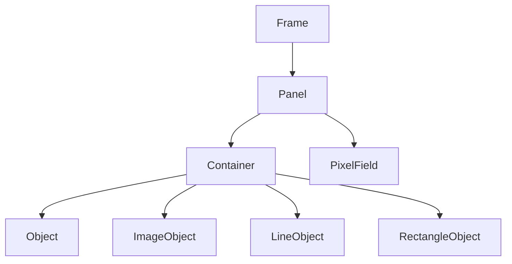

import Img from '../../components/Img.astro'
import LinkCard from '../../components/LinkCard.astro'

import { Github } from 'lucide-astro'

# TL;DR
Ion is a lightweight graphics engine for Java with 3D and Physics I developed. It supports maintainable object management, rendering, and physics simulation. The engine is designed to be easy to use and extend, with a focus on simplicity.

# Architecture

Ion is based on JFrame, built-in Java GUI ToolKit, and extends it with Containers. Containers are the main building blocks of an interface, allowing to manage objects and their properties.

## IonFrame
The IonFrame class extends JFrame and serves as the main window for your game. It provides methods to manage panels, handle fullscreen mode, and customize the window's appearance.

## IonPanel
The IonPanel class extends JPanel and acts as a container for IonContainer objects. It handles mouse and keyboard events and provides a drawing surface for game objects.

## IonContainer
The IonContainer class is responsible for managing game objects (IonObject) and behavior packs (IonBehaviourPack). It provides methods to add, remove, and manipulate game objects, as well as handle drawing and event propagation.

## IonObject
The IonObject class represents a game object in the engine. It provides properties such as position, size, and z-index, as well as methods for movement, resizing, and event handling.

## IonBehaviourPack
The IonBehaviourPack class allows you to define custom behaviors for game objects. It is mutithreaded out-of-the-box, allowing for parallel execution of different objects. Pehavior Packs provide methods for handling mouse and keyboard events, as well as object-specific events.

# Physics
Built in Physics Behaviors Pack tracks gravity and velocity of objects. It provides methods to apply forces, simulate collisions, and handle object interactions. In combination with Draggable behavior, it allows for easy implementation of interactive objects.

# 3D
Ion has 3D rendering capabilities through its custom RayCasting implementation. The WallBuilder first-person demo showcases the engine's capability by rendering an editable 3D maze.

# See More
<LinkCard title="Source code" link="https://github.com/GulkoA/ionengine">
  <Github color="black" slot="icon"/>
</LinkCard>
